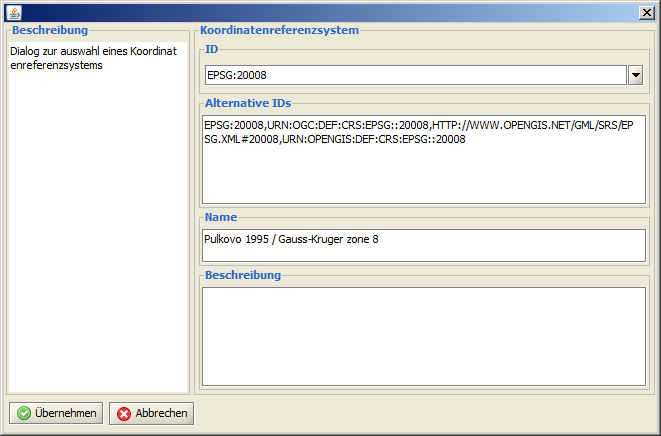
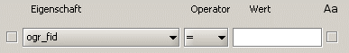
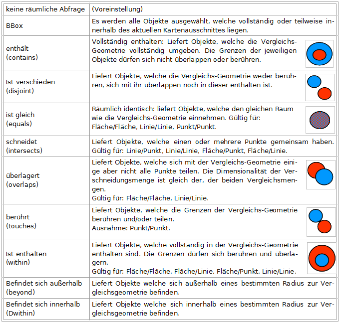
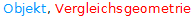
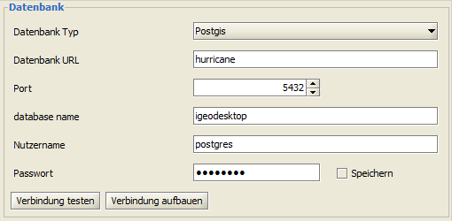
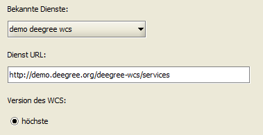
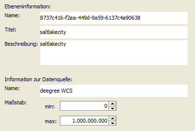
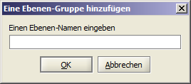

==========================
Kartenebenen importieren
==========================
Einem neu angelegten oder einem bereits bestehenden Projekt können weitere Kartenebenen in Form von Vektor- oder Raster-Daten hinzugefügt werden. Dies geschieht über den Dialog *Ebene hinzufügen*, der über den entsprechenden |addLayer| Button in der Werkzeugleiste oder über die Menüleiste via *Projekt > Ebene hinzufügen* aufgerufen wird. 	

.. |addLayer| image:: images/addLayer.png

-------------------------
Vektordaten importieren
-------------------------
Folgende Vektordatenformate können geladen werden:

	- wfs: 
	- Datenbank: Oracle, Postgis,  
	- Datei: *\*.gml*, *\*.xml*, *\*.gpx*, *\*.shp*

Vektordaten aus Dateien laden
^^^^^^^^^^^^^^^^^^^^^^^^^^^^^^^^

- über die Menüleiste via *Projekt >* |s_openFile| *Ebene aus Datei hinzufügen*. Dieser Weg ermöglicht ein schnelles, direktes Laden der entsprechenden Datei.

- über den |addLayer| *Ebene hinzufügen* Dialog in der Werkzeugleiste. Dieser Weg bietet mehr Einflussnahme auf die entsprechende Datei. Sie können einen Titel und eine Kurzbeschreibung angeben, und bestimmen den Maßstabsbereich und das lazyLoading.

- direkt nach dem Starten von deegreeDesktop, indem man über *Projekt > Datendatei öffnen* ein neues Projekt auf Grundlage der gewählten *\*.shp* anlegt. Nachdem Sie die entsprechende *\*.shp*-Datei ausgewählt und mit ``[Öffnen]`` bestätigt haben, wird im anschließenden Dialog der erforderliche EPSG-Code innerhalb des ID Feldes ausgewählt (das zugehörige Koordinatensystem zeigt Ihnen das Feld Name).

.. |s_openFile| image:: images/s_openFile.png
.. |wfslayer_icon| image:: images/wfslayer_icon.png

Vektordaten aus wfs laden
^^^^^^^^^^^^^^^^^^^^^^^^^^^^^^^^
Im Dialogfenster |addLayer| *Ebenen hinzufügen* über *> Vektordaten* zu |wfslayer_icon| *WFS* navigieren. Diesen Eintrag markieren und auf ``[Weiter]`` klicken. Innerhalb des nächsten Dialoges entweder aus den vorkonfigurierten Services den gewünschten Service auswählen, oder einen neuen Service als URL manuell eingeben und auf ``[Weiter]`` klicken.

Im Anschluss daran aus der Liste verfügbare Objekt-Arten die Objekt-Art auswählen, die als neue Ebene dem Projekt hinzugefügt werden soll. Die gewünschte Ebene durch Klicken auf ``[Fertig]`` laden.

	
Es besteht vor dem Laden der Ebene zusätzlich die Möglichkeit, diese nach bestimmten Kriterien zu filtern und nur die Ergebnisse dieser Abfrage in einer neuen Ebene darzustellen. Hierfür nicht auf ``[Fertig]`` sondern auf ``[Weiter]`` klicken. Im darauf folgenden Dialog definieren Sie optional verschiedene attributive oder/und räumliche Filter, nach denen die zu importierende Ebene durchsucht werden soll.

**attributive Filter**

Diese Filterart durchsucht die Attribute eines Objektes nach zuvor vom Nutzer definierten Kriterien. Über den Button ``[ein neues Merkmal hinzufügen]`` stellt man eine Merkmalsliste zusammen, wobei die Merkmale untereinander über *und* (Voreinstellung) oder *oder* verknüpft werden können. 

Werden die einzelnen Merkmale mit  *und*  verknüpft, werden nur Objekte ausgegeben, welche alle angegebenen Merkmale enthalten. Wählen Sie die Einstellung *oder*, gibt das System alle Objekte, die mindestens eins der angegebenen Merkmale enthalten, aus.
Pro Merkmal können folgende Einstellungen vorgenommen werden: 

	- Die *Eigenschaften* repräsentieren die vorhandenen Attribute eines Objektes, welche über den 
	- *Operator-Typ*  > / >= / <= / <  / = / *ist wie*  mit einem *Wert* verknüpft werden.	 

Ein Attribut kann innerhalb einer Abfrage auch mehrmals mit verschiedenen Wertebereich-Eingrenzungen ausgewählt werden. Wird als Operator *ist wie* verwendet, ist optional festzulegen, ob die Groß- und Kleinschreibung berücksichtigt werden soll (in diesem Fall muss das Häkchen gesetzt werden).	

Bereits erstellte Merkmale entfernen Sie wieder, indem vor ihnen das Häkchen gesetzt wird und der Button ``[ausgewählte Merkmale entfernen]`` geklickt wurde.

**räumliche Filter**

Diese Filterart prüft die Objekte innerhalb der zu ladenden Ebene hinsichtlich ihrer topologischen Eigenschaften. Die Abfrage kann sich entweder auf den aktuell gewählten Kartenausschnitt (BBox), auf eine vorher selektierte Ebene oder eine zuvor selektierte Geometrie (Objekt) als Vergleichs-Geometrie beziehen. 

Folgende Abfragen sind möglich:
 |abfrage| 	

	

	
Nachdem ein oder mehrere Filter definiert wurden, müssen Sie im nächsten Schritt erstellt werden. Dazu im Register Filter auf ``[Filter erstellen]`` klicken: der zusammengestellte Filter wird angezeigt und kann abschließend noch einmal überprüft werden. 
Sie können die Ebene nun durch das Klicken auf ``[Fertig]`` in das Projekt laden oder auf ``[Weiter]`` klicken, um in einem letzten Schritt noch Veränderungen hinsichtlich Titel, Name und Kurzbeschreibung vorzunehmen.

Vektordaten aus einer Datenbank laden
^^^^^^^^^^^^^^^^^^^^^^^^^^^^^^^^^^^^^^^	
Im Dialogfenster |addlayer| *Ebenen hinzufügen* über *> Vektordaten* zu *Datenbank*  navigieren, die­sen Eintrag markieren und auf ``[Weiter]`` klicken. Im nächsten Dialog sind folgende Angaben vorgesehen:

Vor dem Aufbauen der Verbindung kann diese getestet werden – was aber nicht zwingend erfor­derlich ist. Sind die Angaben gültig, wird die Verbindung hergestellt und ein neuer Dialog öffnet sich:

TODO

-----------------------
Rasterdaten importieren
-----------------------
Rasterdaten können in Form von georeferenzierten Bilddateien *\*.gif*, *\*.tif*, *\*.png*, *\*.jpg*, *\*.bmp* (mit WorldFile) über einen wms (Web Map Service) oder einen wcs (Web Coverage Service) in ein Projekt geladen werden. 

Bilddateien laden 
^^^^^^^^^^^^^^^^^
Über den Startdialog |addlayer| *Ebenen hinzufügen* zu  *Rasterdaten >* |raster_filelayer| *Datei* navigieren, diesen Ein­trag markieren auf ``[Weiter]`` und anschließend auf ``[Datei wählen]`` klicken. Zum Speicherort der gewünschten Datei navigieren, die entsprechende Datei auswählen und durch Betätigen des ``[Öffnen]`` Buttons über­nehmen. 

Im Anschluss daran können Angaben zu *Name*, *Titel*, *Kurzbeschreibung* und *Koordinaten­system* ge­macht werden. Nachdem auf ``[Fertig]`` geklickt wurde, wird die ausgewählte Ebene an der untersten Position in der Ebenenansicht hinzugefügt.

Daten aus einem wms laden
^^^^^^^^^^^^^^^^^^^^^^^^^
Innerhalb des Dialogfensters |addlayer| *Ebenen hinzufügen* über *Rasterdaten* zu |wmslayer_icon| *WMS* navigieren. Diesen Eintrag markieren und auf ``[Weiter]`` klicken. In­nerhalb des nächsten Dialoges entweder aus den vorkonfigurierten Services den gewünschten Service auswählen, oder den Service als URL manuell eingeben und auf ``[Weiter]`` klicken.

Die nun zur Verfügung stehenden Ebenen unter­scheiden sich hinsichtlich ihrer Anfragemöglichkeiten wie folgt: 

	|	 |gruen| GetMap und GetFeatureInfo Anfrage möglich
	|	 |gelb| GetMap möglich aber kein GetFeatureInfo
	|	 |rot| GetMap und GetFeatureInfo Anfrage nicht möglich (WMS kann nicht geladen werden)

Im Anschluss daran die gewünschten Ebenen einzeln oder als thematische Gruppe durch Klicken auf |for_green| auswählen und der Ebenenauswahl hinzufügen bzw. durch |back_green| wieder aus der Ebe­nenauswahl entfernen. Durch das Klicken auf |forward_green| sind alle verfügbaren Ebenen in die Aus­wahl übernommen bzw. durch |backward_green| entfernt. Übernimmt man mehrere Ebenen in die Ebenenauswahl, kann ihre Reihen­folge über die entsprechenden Pfeilbuttons |arrow_up| |arrow_down|  angepasst werden. Um eine Ebene in die Auswahl zu übernehmen oder zu verschieben, muss diese zuvor selektiert werden.

Ist die Auswahl und Rei­henfolge festgelegt, laden Sie die ge­wünschten Ebenen, ohne weite­re Einstellungen vorzunehmen, in das aktuelle Projekt, indem Sie auf ``[Fertig]`` klicken. 	
Alle ausgewählten Ebenen werden in der angegebenen Reihenfolge zu einer Ebene zusammengefasst und als *\*.gif* mit nicht transparenter Kartenhintergrunddar­stellung in die Kartenansicht geladen.

Möchten Sie weitere Einstellungen vornehmen, bevor die Ebene(n) final geladen werden, klicken Sie auf ``[Weiter]``. Folgende Einstellungen können dann verändert werden:

	- Vorschau der Ebenendarstellung anzeigen: Häkchen im betreffenden Feld setzten und auf die gewünschte Ebene klicken.
	- Auswahl des Bild-Formates: *\*.gif*, *\*.tif*, *\*.png*, *\*.jpg*, *\*.bmp*
	- Transparente Darstellung des Hintergrundes: immer dann empfehlenswert, wenn die Ebene nicht als unterste Ebene angezeigt werden soll.
	- Einzelnes Laden der ausgewählten Ebenen: in diesem Fall können Namen, Titel und Kurzbeschreibung für die einzelnen Ebenen vergeben werden.
	- Bearbeitung der Ebeneninformationen: Name, Titel, Kurzbeschreibung, Eingrenzung des Maßstabsbereiches.

.. |wmslayer_icon| image:: images/wmslayer_icon.png
.. |wcslayer_icon| image:: images/wcslayer_icon.png

.. |arrow_up| image:: images/arrow_up.png
.. |arrow_down| image:: images/arrow_down.png

Daten aus einem wcs laden
^^^^^^^^^^^^^^^^^^^^^^^^^
Innerhalb des Dialogfensters |addlayer| *Ebenen hinzufü­gen* über *Rasterdaten* zu |wcslayer_icon| *WCS* navigieren, die­sen Eintrag markieren und auf ``[Weiter]`` klicken. Im nächsten Dialog wählen Sie entweder aus den vorkonfigurierten Services den gewünschten Ser­vice oder geben selbigen als URL manuell ein und klicken auf ``[Weiter]``. 	

Innerhalb des nächsten Dialoges aus den verfügbaren Coverages das/die gewünschten auswählen (selektieren) und mittels des |for_green|  Buttons in die Auswahl übernehmen und auf ``[Fertig]`` klicken. In die­sem Fall wir das gewünschte Coverage als *\*.jpeg* geladen.	

Sie haben außerdem die Möglichkeit, über die nächsten zwei Dialogfenster das gewünschte Bild­format zu modifizieren (*\*.jpeg*, *\*.GeoTIFF*, *\*.png*) und weiterführende Angaben zur neuen Ebene vorzunehmen (siehe Abbildung). Hierfür jeweils auf ``[Weiter]`` klicken. 

---------------------------------
Kartenebenen mit Daten verknüpfen
---------------------------------

Mit Hilfe der Funktion *Werkzeuge >* |table_add| *Tabellen hinzufügen*  verknüpfen Sie bereits geladene Ebenen mit weiteren Daten über eine geeignete ID.
Dabei haben Sie die Möglichkeit, ent­weder nur einen View (temporäre Verbindung) oder eine neue Ebene zu erzeugen. Als Datenquelle können Dateien oder Datenbanken dienen: 

- *\*.cvs* (Comma-Separated Values) Textdatei zur Speicherung oder zum Austausch einfach strukturierter Daten
- *\*.xls* (Excel Spreadsheet bis 1997) und *\*.xlsx* (Excel Spreadsheet 2007/08) Tabellenkalkulationsprogramm von Microsoft
- *\*.dbf* (ab dBASE IV)

Tabellen aus Dateien laden
^^^^^^^^^^^^^^^^^^^^^^^^^^	 
Klicken Sie auf ``[Weiter]`` nachdem Sie den Verbindungstyp (neue Ebene oder View) und die Da­tenquelle (Datei) ausgewählt haben, und anschließend auf ``[Datei auswählen]``. Navigieren Sie zum Speicherort der gewünschten Datei, und öffnen Sie diese. Klicken Sie auf ``[Weiter]``. 

Im nächsten Schritt müssen Sie die ID, über welche die Ebene mit der Ta­belle verbunden werden soll, definieren (Sie können über ``[Hinzufügen]`` auch mehr als ein Schlüs­selpaar definie­ren). Klicken Sie auf ``[Weiter]``.	 
Geben Sie nun den Postfix der neuen Spalte an und – sofern ausgewählt - den Namen der neuen Ebene. Beenden Sie den Prozess mit ``[Fertig]``.

Tabellen aus Datenbanken laden	
^^^^^^^^^^^^^^^^^^^^^^^^^^^^^^ 
Wählen Sie den Verbindungstyp (neue Ebene oder View) und die Datenquelle (Datenbank). Klicken Sie auf ``[Weiter]``.	 
Nehmen Sie alle nötigen Einstellun­gen unter Datenbank vor und klicken Sie auf ``[Verbindung tes­ten]`` bzw. auf ``[Verbinden]``. Sind Ihre Angaben korrekt, können Sie nun eine Tabelle aus der Aus­wahlliste durch Anklicken auswäh­len. Klicken Sie auf ``[Weiter]``. 	

Im nächsten Schritt definieren Sie die Schlüsselpaare, bestätigen Sie mit ``[Weiter]``.Geben Sie den Postfix der neuen Spalte an und – sofern ausgewählt - den Namen der neuen Ebene. Beenden Sie den Prozess mit ``[Fertig]``.

-----------------------
Kartenebenen gruppieren
-----------------------
In der Ebenenansicht haben Sie die Möglichkeit über das Kontextme­nü eine neue leere Ebenen­gruppe einzufügen. In diese Gruppe können Sie anschließend neue Ebenen la­den oder bereits existierende Ebenen verschieben. 

Das Anlegen einer einzelnen leeren Ebene ist derzeit noch nicht möglich. Alternativ können ein bis mehrere zuvor selek­tierte Objekte aus einer bereits vor­handenen Ebene in eine neue Kartene­bene kopiert werden, die dann der Ebenen- und Karten­ansicht hinzugefügt wird. 	
