=====================================
Darstellung von Kartenebenen arbeiten
=====================================

Mit Hilfe der Funktion: |palette| *Objekt Darstellung bearbeiten* verändern Sie sowohl Raster-, als auch Vek­tordaten hinsichtlich ihres Erscheinungsbildes. Nachdem die entsprechende Ebene in der Ebenenansicht sichtbar geschaltet und selektiert wurde, ruft man diese Funkti­on entwe­der über die Menüleiste  *Werkzeuge > Objekt-Darstellung bearbeiten*, das Kontextmenü der Ebene in der Ebenenansicht oder über den |palette| Button in der Werkzeugleiste auf. 

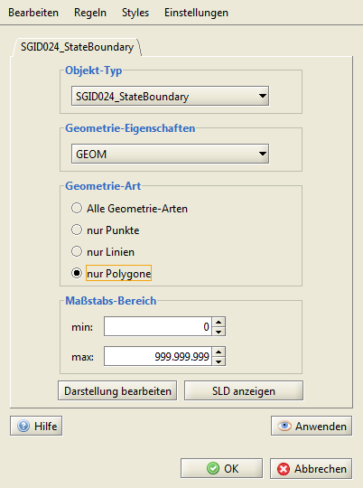

Für jede Ebene können Sie verschiedene Darstellungs-*Regeln* erstellen. Als Voreinstellung wird im Startdialog nur eine Regel mit dem Namen der ausgewählten Ebene angezeigt. Mehr zu Regel siehe Kapitel...
	
Der Startdialog zeigt für jede Regel den Objekt-Typ, die Geometrie-Eigenschaften, die Geometrie-Art und den Maßstabsbereich an. Über *Einstellungen > Einheit* setzen Sie die verwendete Einheit (Pixel oder Karteneinheit) global. Diese Einstellung kön­nen Sie innerhalb der einzelnen Register lokal überschreiben.

Mit Hilfe des Buttons ``[Darstellung bearbeiten]`` rufen Sie die eigentliche Anwendung für die jeweilige Regel auf. 

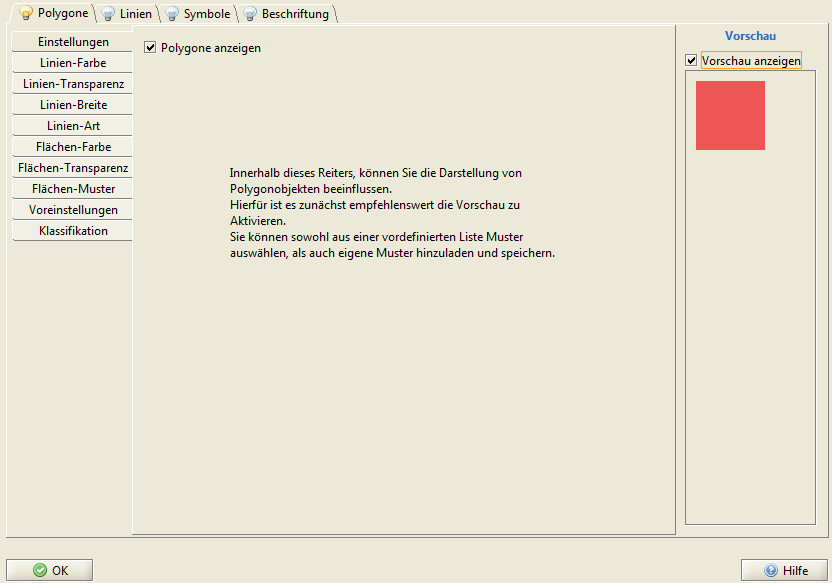

Hier können Sie die jeweiligen Register (Polygone, Linien, Symbole, Beschriftung) aktivieren. Die jeweils aktivierten Register werden mit dem Symbol |flag_green| gekennzeichnet. Da eine Ebene auch mehr als eine Geometrie-Art enthalten kann, ist es möglich, das auch mehrere Register gleichzeitig aktiviert sind. Geometrie-Arten deren Register nicht aktiviert wurden, werden in der Kartenansicht nicht darge­stellt, können aber bearbeitet werden. 

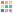
.. |flag_green| image:: images/flag_green.png

-------------------------
Vektordaten 
-------------------------
Folgende Bearbeitungsoptionen sind für Vektorbasierte Darstellungen möglich:

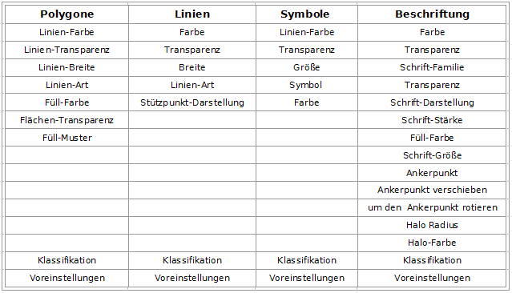
	

Farben bearbeiten
^^^^^^^^^^^^^^^^^

Das Farbschema ruft man jeweils über den Farbkreis-Button als separaten Dialog auf. Innerhalb dieses Dialoges ist es möglich, aus vordefinierten Muster-Farben, HSB und RGB Farbräumen, sowie über die Funktion Grab from Screen die gewünschten Farben zu wählen. Durch das Bestätigen mit ``[OK]`` werden die Änderun­gen über­nommen und durch Klicken auf ``[Anwenden]`` in der Kartenansicht angezeigt. 

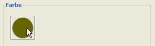

**Muster**

Die vordefinierten Muster im ersten Register wurden an­hand des RGB-Farbschemas erstellt und können durch einfaches Anklicken mit der Maus ausgewählt werden. Die angeklickten Farben erscheinen im Aus­wahlbereich auf der rechten Seite, in welchem sie ebenfalls selek­tiert werden können.

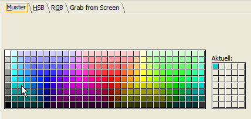

**RGB**

Das RGB-Modell baut auf dem Prinzip der additiven Farb­mischung der Primärfarben Rot, Grün und Blau auf: alle drei Farben zusammen ergeben weißes Licht, keine Farbe schwarz. Das additive Farbmischverfahren wird immer dann angewendet, wenn Licht direkt, also ohne Reflexion durch einen Gegenstand, in das menschliche Auge ge­langt (also etwa bei einem Farbbildschirm).
Für den Ras­terdruck auf Papier ist es da­gegen weniger ge­eignet. Jede der drei Grundfarben kann eine Intensität von 256 Stufen anneh­men, dies ergibt für die Darstellung auf einem Com­putermonitor ca. 16 Millionen darstell­bare Farben. 

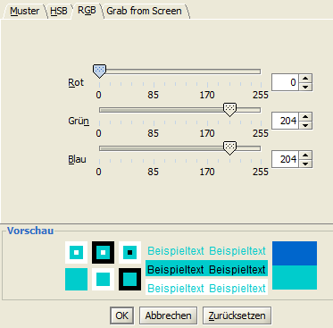

**HSB**

Das HSB Farbmodell hat den Vorteil, dass es sich an der Farbwahrnehmung des menschlichen Auges orientiert. Dieses zerlegt die Farbinformation nicht in drei, son­dern in zwei Kanäle: in Farbton+Sättigung und  Hellig­keit. 

|	*Farbton (Hue)*: Farbeindruck einer bestimmten elektro-ma­gnetischen Wellenlänge.	 
|	*Sättigung (Saturation)*: Rein­heitsgrad des Farb­tones rela­tiv zu einem neutralen Grau. Ungesättigte Far­ben se­hen gräu­lich aus.	 
|	*Helligkeit (Brightness)*: die Wahrnehmung der Farbinten­sität, des Leuchtens einer Farbe. 

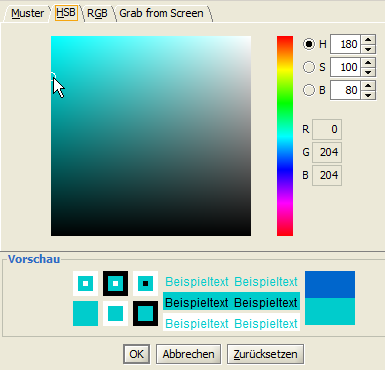

	
**Grab from Screen**

Mit Hilfe dieser Funktion werden Farben aus Abbildungen u.ä. selektiert und übernommen. Hierfür zu­erst mit der lin­ken Maustaste auf das Lupensymbol klicken. 	
Danach wird der Mauszeiger bei gedrückt gehalte­ner linker Maustaste über die Bereiche auf dem Bild­schirm bewegt, in welchen sich die gewünschte Farbe be­findet.
In dem sich unterhalb des Lupensymbols befindli­chen Fenster sind diese Bereiche vergrößert darge­stellt. Die Far­be, die sich inner­halb des kleinen Quadrats befindet, wird nach dem Loslassen der linken Maustaste ausgewählt.

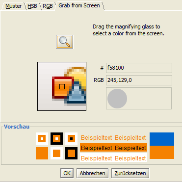

Klassifikation
^^^^^^^^^^^^^^^^^
Polygone, Linien, Punktobjekte und Beschriftung können klassifiziert werden. Die Klassifikation dient als Hilfsmittel zur Strukturierung und Verdichtung von Informationen. 

Wird eine Schwarz-Weiß Darstellung bzw. eine Helligkeitsabstufung einer Farbe gewählt, ist das menschliche Auge fähig, nur bis zu 7 Klassen auch sicher zu unterscheiden. Bei Farbverläufen mit zwei Farben schafft es noch bis zu 14 Klassen. Dies sollte bei einer Klassifikation ebenso beachtet werden, wie die Tatsache, dass gebildete Gruppen nicht weniger als zwei Elemente enthalten soll­ten. 

Eine Klasse mit nur einem Element widerspricht dem Grundsatz, dass Elemente einer Klasse untere­inander ähnlicher sind als die in unterschiedlichen Klassen. Ausnahmen bilden Extremwerte oder sachlogische Werte (Indexzahlen, Nullwerte, gesetzlich festgelegte oder physikalische Grenz­werte), die je nach Kontext hervorgehoben werden sollten.

Das Hauptziel einer Klassifizierung stellt die Veranschaulichung von räumlichen Mustern und Struktu­ren, nicht die Visualisierung von statistischen Einzelwerten an sich, dar. Ein Grundprinzip der themati­schen Kartographie liegt im weniger ist mehr: erst durch die Reduktion der Detailinfor­mationen von Objekten auf die Ausprägungen weniger Klassen, werden die wesentlichen Grundzü­ge räumli­cher Muster klar ersichtlich. 
Derzeit stehen folgende Klassifikationen zur Verfügung:	

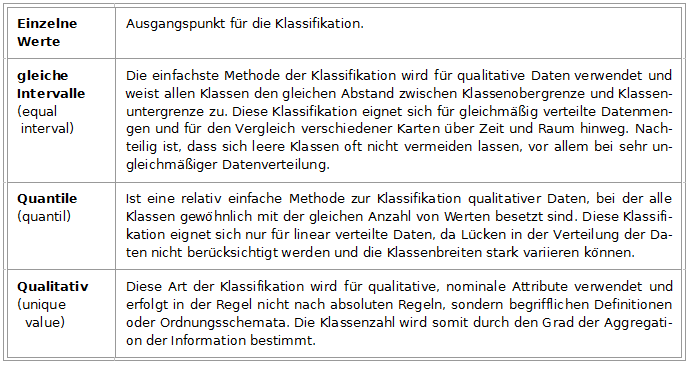

	
Handelt es sich um einen unbekannten Datensatz, ist es von Vorteil sich vor der Klassifikation die Verteilung der Daten anzusehen, für die Wahl der geeignete Methode. Hierfür steht nach der Se­lektion des entsprechenden Attributes die Option ``[Histogramm anzeigen]``   zur Verfü­gung. 

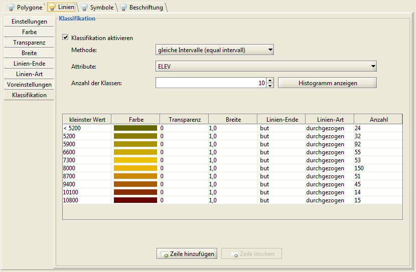

Jede automatisch erstellte Klassifikation, kann manuell hinsichtlich ihrer Klassenober- und untergrenzen ange­passt werden. Nach der Korrektur des Wertes und dem Betätigen der ``[Enter]`` Taste wird die Ab­folge der Klassen neu sortiert. Die anderen Klassenbreiten bleiben dabei unverändert. 

Darstellung bearbeiten
......................

Innerhalb der Klassifikation kann jeder Wert innerhalb einer Zeile verändert werden. 

	- **Wertefeld**: die Beschriftung kann über das Kontextmenü (klick mit der RM) bearbeitet werden. Es werden nicht die Werte geändert, sondern die Beschriftung wie sie in der Legende angezeigt wird.

	- **Zahlenwerte**: durch Doppelklick mit der LM öffnet sich das entsprechende Kontextmenü. Sie können entweder manuell einen neuen Wert eingeben oder die Pfeiltasten verwenden. Drücken sie die ``[Enter]`` oder ``[Tab]`` Taste der Tastatur um die Änderungen zu übernehmen.

	- **Farbwerte**: durch Doppelklick mit der LM öffnet sich das entsprechende Kontextmenü.

	- **Muster/Symbole/Linienenden**: durch Anklicken mit der LM öffnet sich die Auswahlliste.

Alle Darstellungsvorschriften können auch Spaltenweise bearbeitet werden. Sie öffnen das entsprechende Kontexmenü mit einem Klick mit der RM auf den jeweiligen Spaltennamen.

	- **Farben**: es kann eine feste Farbe festgelegt oder Farbverläufe definiert werden (siehe Farbrampen erstellen)
	- **Transparenz/Linien**: es kann entweder ein fester Wert oder ein Intervall festgelegt werden
	- **Symbole**: es kann aus einer Auswahlliste oder Symbolbibliothek eine Symbol gewählt werden.

Farbrampen erstellen
....................
Innerhalb des Dialoges *Farbschema* aktivieren. Sind bereits Farbrampen defi­niert worden, sind diese über das Drop-Down Menü auszuwählen. Ist dies nicht der Fall oder soll eine neue Farbrampe definiert werden, auf ``[neues Farbsche­ma]`` klicken. In einem neuen Dia­logfenster kann nun der Farbverlauf definiert werden:

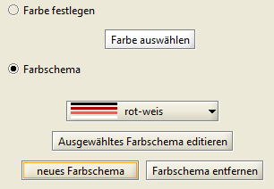

Jedem der drei über der Farbrampe befindlichen Felder kann eine bestimmte Farbe und Position zugeordnet wer­den. Hier­zu zuerst das betreffende Feld durch Ankli­cken aus­wählen. Der Farbdialog wird durch das Anklicken der Farbanzeige (Kreis) geöffnet. Die Farbfelder können direkt durch Klicken und Ziehen mit dem Mauszei­ger oder über die Angabe eines pro­zentualen Wertes ver­schoben werden. Über ``[Hinzufü­gen/Entfernen]`` lassen sich weitere Farben hinzu­fügen bzw. wieder entfernen. 

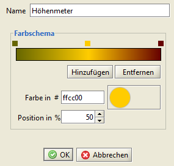

Durch das Eingeben einer Bezeichnung und anschließen­des Klicken auf ``[OK]`` sind die Einga­ben bestätigt und übernomm­en.

	
Muster bearbeiten
^^^^^^^^^^^^^^^^^

Symbole bearbeiten
^^^^^^^^^^^^^^^^^^^

Symbolbibliotheken erstellen
^^^^^^^^^^^^^^^^^^^^^^^^^^^^
Es ist möglich neue Bibliotheken anzulegen, bestehende Bibliotheken zu importieren und die ver­fügbaren Bibliotheken zu bearbeiten (Symbole hinzufügen oder entfernen).  Navigieren Sie innerhalb des Objektdarstellung bearbeiten – Startfensters zu *Bearbeiten > Symbolbiblio­thek*.

Regeln erstellen
^^^^^^^^^^^^^^^^
Innerhalb einer Kartenebene kann mit verschiedenen Darstellungs-*Regeln* gearbeitet werden. Über *Regel* > |rule_add| *Regel hinzufügen*  ist es möglich für z.B. jede Geometrie-Art (betref­fende Geometrie-Art innerhalb der Regel selektieren) eine eigene Darstellungsregel zu definieren, bzw. Regeln für ver­schiedene Maßstabsbereiche einer Geometrie-Art zu erstellen, usw. 

Darüber hinaus können Regeln auch |rule_copy| *dupliziert* , |rule_edit| *umbenannt* oder |rule_delete| *gelöscht* werden. 

Jede erstellte Regel kann auch als *\*.sld* exportiert werden. Klicken Sie auf ``[SLD anzeigen]`` und im sich neu öffnenden Dialogfenster auf ``[SLD speichern]``.

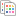

Stylevorschriften exportieren/importieren
^^^^^^^^^^^^^^^^^^^^^^^^^^^^^^^^^^^^^^^^^^^
Sollen die definierten Darstellungen auch für andere Projekte ver­fügbar sein, müssen sie exportiert werden. Dies geschieht inner­halb des Startdialogs der Darstellungsbearbeitung über	 
*Styles >* |sld_export| *Styles exportieren*. Im sich anschließend öff­nenden Fenster gibt man Name und Speicherort der *\*.xml* Datei an. 

Die so exportierten Darstellungs-Defi­nitionen können nun auch über *Styles >* |sld_import| *Styles importie­ren* in andere Projekte geladen werden. Wurde auf diesem Weg eine neue Definition geladen, wird diese über den Button ``[Anwenden]`` sichtbar geschaltet und mit ``[OK]`` übernommen. 

Die für die jeweilige Geometrie be­reits vorhandenen Darstellungen zeigt dar Register *Voreinstell­ungen* innerhalb der eigentlichen Darstellungsbearbeitung. Sie können dort durch Anklicken ausgewählt und im Vorschaufenster ein­gesehen werden.

-------------------------------
Beschriftung frei positionieren 
-------------------------------
Vorraussetzung:
Wählen Sie eine Vektorebene, welche die Beschriftung enthält in der Ebenenansicht aus und öffnen sie die Funktion |palette| *Objekt Darstellung bearbeiten*. Klicken Sie auf ``[Darstellung bearbeiten]`` und gehen Sie in das Register **Beschriftung**.
Wählen Sie mindestens eine der folgenden Optionen aus:

	- *Verschiebung zum Ankerpunkt*: wählen Sie attributabhängige Verschiebung und ein geeignetes Feld
	- *Rotation zum Ankerpunkt*: wählen Sie attributabhängige Rotation und ein geeignetes Feld
	
Klicken Sie auf ``[Ok]`` und verlassen sie den Dialog mit ``[Ok]``.

Aktivieren Sie nun in der Werkzeugleiste die Funktion |tag_blue|  *Schriftplazierung bearbeiten*. 

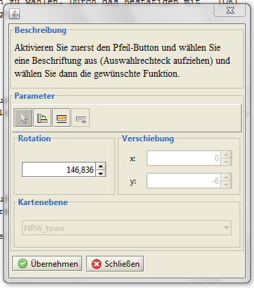
	
Aktivieren Sie die |select| Funktion und ziehen sie über der zu verändernden Beschriftung ein Auswahlrecht auf.
In der Kartenansicht erscheint ein grünes Auswahlrechteck.
Im Dialog werden die Funktionen aktiviert (Verschiebung, Rotation) welche Sie zuvor als attributabhängig deklariert haben.

| |label_move| Beschriftung verschieben
| |label_rotate| Beschriftung rotieren
| |align_to_line| Beschriftung an Liniensegment ausrichten

Wählen Sie die gewünschte Funktion durch Anklicken aus. Anschließend können sie für *Verschieben/Rotieren* die gewünschten Werte eintragen oder mit dem Mauszeiger via Drag&Drop das grüne Auswahlrechteck entsprechend plazieren. Möchten Sie die Beschriftung an einem Liniensegment ausrichten wählen Sie bitte eine Kartenebene als Referenz aus. Bestätigen Sie mit ``[Übernehmen]``.

.. |tag_blue| image:: images/tag_blue.png

.. |select| image:: images/select.gif

-------------------------
Rasterdaten 
-------------------------
Rasterdaten können hinsichtlich ihrer Transparenz und der Helligkeit bearbeitet werden.
Hierzu die entsprechende Ebene in der Ebenenansicht sichtbar schalten und selektieren, dann die Funkti­on entwe­der über die Menüleiste  *Werkzeuge > Objekt-Darstellung bearbeiten*, das Kontextmenü der Ebene in der Ebenenansicht oder über den |palette| Button in der Werkzeugleiste aufrufen. 

