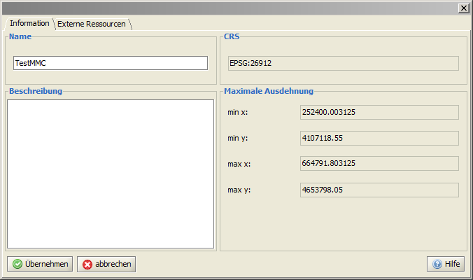
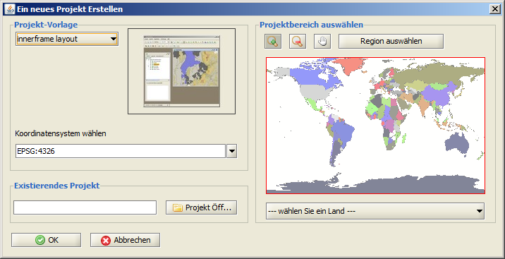
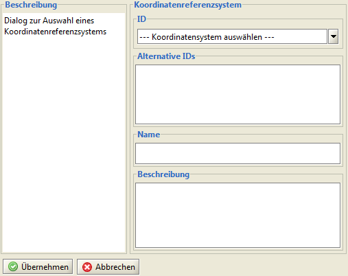
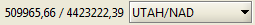
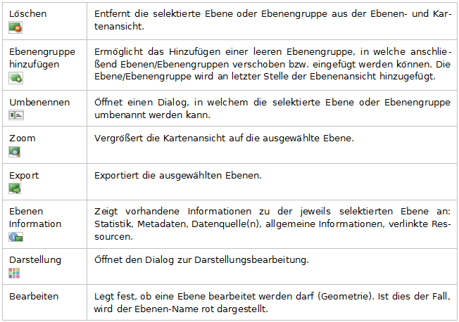

=====================
Basisfunktionalität
=====================

----------------------
Arbeiten mit Projekten
----------------------

Der Kern der Anwendung ist die Projektdatei *\*.prj*. Die Projektdatei kann hinsichtlich des zur Verfügung stehenden Funktionsumfanges und des Layouts verschieden konfiguriert werden. Derzeit ist es noch nicht möglich, diese Konfiguration über die GUI vorzunehmen. Dies kann nur mit Hilfe eines entsprechenden xml-Editors geschehen.

Über *Projekt > Projektinformation öffnen* sehen Sie die allgemeinen Projekteigenschaften. Diese lassen sich teilweise bearbeiten (Projektname, Beschreibung, externe Ressourcen).	

Ein Projekt kann mehrere Kartenfenster mit verschiedenen Ebenen-Zusammenstellungen enthalten. Diese können über die entsprechenden Buttons in der Symbolleiste |mapwindow_add| neu angelegt, |mapwindow_open| geöffnet und |mapwindow_delete| geschlossen werden. Die Ebenen- und Legendenansicht zeigt dann immer die Ebenen-Zusammenstellung des jeweils aktiven Kartenfensters. Mit Hilfe des |mapwindow_syn| Buttons synchronisiert man alle geöffneten Kartenfenster anhand des gerade aktiven Kartenfensters hinsichtlich ihrer BBOX.

.. |mapwindow_add| image:: images/mapwindow_add.png
.. |mapwindow_open| image:: images/mapwindow_open.png
.. |mapwindow_delete| image:: images/mapwindow_delete.png

Projekte öffnen
^^^^^^^^^^^^^^^

Das Dialogfenster zum Öffnen existierender Projekte ist entweder über *Projekt > Projekt öffnen*, durch Betätigen der Tastenkombination ``Strg+O`` oder innerhalb der Werkzeugleiste über den |open| Button erreichbar. Navigieren sie innerhalb des Installationsverzeichnisses der Anwendung zu *deegreeDesktop/resources/data*. Innerhalb des Dialogfensters können Sie aus den vorhandenen Projekten ein Projekt auswählen und laden.

.. |open| image:: images/open.png

Projekte neu anlegen
^^^^^^^^^^^^^^^^^^^^^

Das Dialogfenster zum Anlegen neuer Projekte ist entweder über *Projekt >* |newProjectOpen| *neues Projekt anlegen*, oder durch Betätigen der Tastenkombination ``Strg+N`` zu öffnen. Innerhalb des Dialogfensters wählen Sie entweder einen entsprechend vorkonfigurierte Projektvorlage (xml-Templates) oder verwenden die Einstellungen eines bereits existierenden Projektes als Vorlage. 

		
Zusätzlich ist die Region (entweder als Land aus der Drop-Down Liste oder durch Aufziehen eines Auswahlrechtecks) und das Koordinatensystem (EPSG) auswählbar, das dann für alle Ebenen innerhalb dieses Projektes gilt. Klicken Sie bitte nach dem Auswählen der Region auf den ``[Region auswählen]`` Button.

.. |newProjectOpen| image:: images/newProjectOpen.png

Projekte aus *\*.shp* Dateien neu anlegen
^^^^^^^^^^^^^^^^^^^^^^^^^^^^^^^^^^^^^^^^^
Sie können neue Projekte auch direkt aus *\*.shp* Dateien generieren. Navigieren Sie sie nach dem Starten der Anwendung in der Startbildschirm Ansicht innerhalb der Menüleiste zu *Projekt > Datendatei öffnen* oder nehmen Sie die Tastenkombination ``Strg+P``. Navigieren Sie zum Speicherort der gewünschten Datei und öffnen sie diese.

Im nachfolgenden Dialog, definieren sie das CRS über den EPSG-Code:

mit ``[Übernehmen]`` legen Sie das neue Projekt an.

Projekte speichern
^^^^^^^^^^^^^^^^^^
Bereits geöffnete Projekte können Sie entweder unter dem bestehenden Namen oder unter einer alternativen Bezeichnung abspeichern. 
In beiden Fällen werden sowohl Datenbestand, als auch Darstellungs-Definitionen gespeichert.

Im ersten Fall über *Projekt > Projekt speichern*, die Tastenkombination ``Strg+S`` oder innerhalb der Werkzeugleiste über den |save| Button.	

Soll das Projekt unter einem neuen Namen gespeichert werden, wird  *Projekt >* |save_as| *Projekt speichern als...* verwendet. In diesem Fall muss neben dem neuen Projektnamen die Dateiendung *\*.prj* angegeben werden. 

Wichtig
	Speichern sie Ihre *\*.prj* immer im Ordner *deegreeDesktop/resources/data*. 

.. |save| image:: images/save.png

-----------------------
Navigation in der Karte
-----------------------

Kartenausschnitt verschieben 
^^^^^^^^^^^^^^^^^^^^^^^^^^^^
- nach dem Aktivieren der Funktion |pan| via drag&drop mit dem Mauszeiger
- ohne Funktionsauswahl über die Pfeiltasten der Tastatur 

Die Funktion befindet sich im Kontextmenü der Kartenansicht, in der Menüleiste unter *Ansicht* und in der Werkzeugleiste. 
Prinzipiell ist das Verschieben des Kartenausschnittes mit den Pfeiltasten der Tastatur auch während der Bearbeitung von Objekt-Geometrien möglich.

Kartenausschnitt vergrößern/verkleinern
^^^^^^^^^^^^^^^^^^^^^^^^^^^^^^^^^^^^^^^
Vergrößern 

	- nach dem Aktivieren der |zoomin| Funktion durch Klick mit der LM in die Karte oder das Aufziehen eines Auswahlrechteckes. Es wird auf den Klickpunkt/das Auswahlrechteck zentriert.
	- ohne Funktionsauswahl über die ``[+]`` Taste der Tastatur und über das Mausrad, hierbei wird der Kartenmittelpunkt beibehalten

Verkleinern

	- nach dem Aktivieren der |zoomout| Funktion durch Klick mit der LM in die Karte. Es wird auf den Klickpunkt zentriert.
	- ohne Funktionsauswahl über die ``[-]`` Taste der Tastatur und über das Mausrad, hierbei wird der Kartenmittelpunkt beibehalten

Verkleinern auf volle Ausdehnung

	- durch das Aktivieren der  |fullext| Funktion im Kontextmenü der Kartenansicht, in der Werkzeugleiste oder in der Menüleiste über *Ansicht > auf Kartenausdehnung verkleinern* 
	- die volle Ausdehnung entspricht der definierten BBox (entweder im angefragten Dienst oder wie sie innerhalb der *.prj Datei für das Kartenmodul definiert ist.)

Innerhalb der Anwendung ist es zudem möglich, auf ausgewählte Objekte, Ebenen  oder bestimmte Koordinaten zu vergrößern. Diese Funktionalitäten finden sich in der Menüleiste unter *Ansicht*, im Kontextmenü und in der Werkzeugleiste.

Vergrößern der Kartenansicht auf die ausgewählte Ebene  

	- nach dem selektieren einer Ebene in der Ebenenansicht durch das Aktivieren der Funktion |zoomlayer|
	- die Ausdehnung entspricht der definierten BBox der Ebene

Vergrößern auf selektierte(s) Objekt(e) 

	- nach dem selektieren eines oder mehrerer Objekte in der Kartenansicht und durch das Aktivieren der Funktion |zoomtofeature|
	- nach dem selektieren eines oder mehrerer Objekte in der Attributtabelle und durch das Aktivieren der Funktion |lupe| 

Vergrößern auf Koordinaten 

	- nach dem Öffnen des Dialoges |zoombycoord| in der Menüleiste unter *Ansicht* durch Eingabe der Koordinaten 

.. |zoomin| image:: images/zoom_in.png
.. |zoomout| image:: images/zoom_out.png
.. |fullext| image:: images/zoomtofullextent.png 
.. |zoomlayer| image:: images/zoomToLayers.png

.. |zoombycoord| image:: images/zoombycoord.png
.. |lupe| image:: images/lupe.png

Kartenausschnitt zentrieren
^^^^^^^^^^^^^^^^^^^^^^^^^^^
Neben den bereits genannten indirekten Möglichkeiten der Karten-Zentrierung ist es ebenso möglich, die Karte ohne Veränderung der Ausschnittsgröße auf einen bestimmten Punkt zu zentrieren, auf  welchen in der Karte geklickt wurde. Diese Funktion findet sich unter  *Ansicht >* |center|  *Karte zentrieren*, im Kontextmenü der Kartenansicht und in der Werkzeugleiste.

Maßstab verändern
^^^^^^^^^^^^^^^^^
Grundsätzlich wird bei jeder Veränderung des Kartenausschnittes der aktuelle Maßstab in der Werkzeugleiste angezeigt, wo er auch manuell durch das Eintragen eines entsprechenden Wertes verändert werden kann. 
Darüberhinaus kann innerhalb der Werkzeugleiste auch aus einer Reihe vordefinierter Maßstäbe ausgewählt werden:
	- 1:100.000
	- 1:250.000
	- 1:500.000
	- 1:1.000.000
	- 1:5.000.000
	- 1:10.000.000
	

Koordinatenreferenzsystem Anzeige
^^^^^^^^^^^^^^^^^^^^^^^^^^^^^^^^^^^
Sie können sich das dem Projekt zugewiesene Koordinatensystem über *Projekt > Projektinformation anzeigen* anzeigen lassen.

Im unteren linken Bereich der Anwendung befindet sich die Koordinatenanzeige, welche Ihnen die Koordinaten anzeigt, welche gerade vom Mauszeiger überfahren werden. Im Auswahldialog daneben können Sie verschiedene Koordinatenreferenzsystem auswählen. 

Wichtig
	Mit diesem Auswahldialog ändern Sie nicht das CRS für das Projekt! Sie können sich lediglich die Koordinaten in einem anderen CRS anzeigen lassen.
	
	
Historie
^^^^^^^^
Da innerhalb der aktuellen Sitzung die jeweiligen Kartenansichten in ihrer Abfolge gespeichert werden, ist es möglich, innerhalb dieser Historie zu navigieren. Dies geschieht über die entsprechenden Buttons |arrow_left| |arrow_right| in der Werkzeugleiste und der Menü-Leiste unter *Ansicht > Rückgängig/Wiederholen*.

.. |arrow_right| image:: images/arrow_right.png
.. |arrow_left| image:: images/arrow_left.png

Mit Lesezeichen arbeiten
^^^^^^^^^^^^^^^^^^^^^^^^
Innerhalb der Anwendung können verschiedene Kartenausschnitte als Lesezeichen gespeichert und zwischen diesen navigiert werden. Die Lesezeichenverwaltung öffnen Sie über den |bookmark| Button in der Werkzeugleiste. Hier werden alle Lesezeichen inklusive einer kurzen Beschreibung angezeigt. Nachdem durch Klicken mit der linken Maustaste in die betreffende Zeile ein Lesezeichen markiert ist, kann durch das Aktivieren des |bookmark_show| Buttons innerhalb des aktiven  Kartenfensters zum entsprechenden Ausschnitt navigiert werden. 

Neue Lesezeichen legen Sie entweder innerhalb der Lesezeichenverwaltung, oder aber direkt über die Werkzeugleiste jeweils mit Hilfe der |bookmark_add| Buttons an. Hierbei können Sie festlegen,  ob das jeweilige Lesezeichen für alle oder nur für ein bestimmtes Kartenfenster gelten soll.
Über die Funktion |bookmark_export| *Lesezeichen exportieren* exportieren Sie Ihre Lesezeichensammlung als *\*.xml* Datei. Diese können Sie erneut laden über |bookmark_import| *Lesezeichen importieren*.

.. |bookmark| image:: images/bookmark.png

-------------------------
Kartenebenen organisieren
-------------------------

Die einzelnen Ebenen oder Ebenengruppen können in ihrer Reihenfolge verändert werden. Die Reihen­folge hat Einfluss darauf, ob Ebenen in der Kartenansicht sichtbar, oder von anderen Ebe­nen ver­deckt sind. Die erste Ebene in der Ebenenansicht ist in der Kartenan­sicht als oberste Ebene dargestellt, die letzte Ebene als unterste. Um eine Ebene oder Ebenengruppe zu verschie­ben, muss diese mit der linken Maustaste angeklickt und dann bei gedrückter Maustaste neu position­iert werden.	 
Sobald eine Ebene oder Ebenengruppe verschoben wird, zeigt Ihnen eine grüne Markierung an welcher Stelle sie eingefügt wird.

Für die in der Ebenenansicht aufgelisteten Ebenen bietet das Kontextmenü (Klick mit der rechten Maustaste auf die entsprechende Ebenen) folgende Funktionen:	

	
--------------------------------------
Informationen zur Kartenebene aufrufen
--------------------------------------
Nachdem eine Ebene in der Ebenenansicht selektiert ist, öffnen Sie über das Kontextmenü durch das Klicken auf |layerinfo| Ebenen Information eine neues Fenster mit weiterführenden Informationen.	 
Innerhalb des Registers Info werden Angaben zu Status, Beschreibung, Maß­stabsbereich und Le­gende gemacht. Die Legendensymbole sind hier nicht bearbeitbar, allerdings können die Beschrei­bung und der Maßstabsbereich (innerhalb dessen die Ebene in der Kartenansicht angezeigt wird) verändert werden. Durch Klicken auf ``[Über­nehmen]`` sind die Änderungen gespeichert.	

| = sichtbar   
| = abfragbar   
| = bearbeitbar   
| = zum Bearbeiten ausgewählt

In dem Register Metadaten können jeweils neue Datenquellen über ``[URL für Metadaten hinzu­fügen]`` ein­gepflegt oder über ``[URL für Metadaten entfernen]`` entfernt werden. Bereits beste­hende Verknüpfungen sehen Sie über ``[Metadaten öffnen]``.

Innerhalb des Registers Ressourcen fügen Sie über ``[Zeile hinzufügen]``  Verweise zu Text/html oder Bilddatei­en hinzu. Das Klicken auf ``[go to]`` öffnet diese Verweise dann in einem separaten Brow­serfenster. Es empfiehlt sich immer, die eingegebene url auf ihre Richtigkeit zu überprüfen.

Das Register Datenquellen stellt Informationen zu Namen und Pfadangabe der Da­tenquellen, der BBox (Ausdehnung), dem Maßstabsbereich (hinsichtlich der Anzeige) und des La­deverhaltens (lazyLoading) bereit.	 
Um zwischen den einzelnen Datenquellen zu navigieren, muss die je­weilige Datenquelle auf der linken Seite des Dialogfensters durch Anklicken ausgewählt werden.	

Innerhalb des Registers Statistik  be­steht die Möglichkeit eine er­weiterte Berechnung der statisti­schen Angaben für diese Ebene durch­zuführen. Hierfür klicken Sie auf den Button ``[Erweiterte Ebe­nen-Statistik berechnen]``.

.. |layerinfo| image:: images/layerinfo.png

-------------------
Legende bearbeiten
-------------------

Die Legende kann als Bilddatei exportiert werden. Hierzu das Kontextmenü aufrufen und entweder |legend_copy| *Legende als Bild kopieren* oder |legend_export| *Legende als Bild exportieren* wählen. 

Jedes Legendensymbol kann durch eine eigene Graphik ersetzt werden. Hierfür mit der linken Maustaste das entsprechende Symbol anklicken. In dem sich anschließend öffnenen Dialog zum Speicherort der gewünschten Graphik navigieren und diese laden. Die neue Graphik hat keinen Einfluß auf die Darstellung nnerhalb der Kartenansicht, sondern wird nur beim Drucken der Karte (sofern die ausgabe der Legend egewünscht wird) berücksichtigt.

-------------------------
Kartenansicht exportieren
-------------------------
 
Die Kartenansicht kann als Bilddatei exportiert werden. Hierzu innerhalb der Menüleiste über Projekt  zu  |map_copy| *Karte als Bild kopieren* / |map_export| *Karte als Bild exportieren* navigieren. 	

.. |map_export| image:: images/map_export.png 

-------------------------
Projekte speichern
-------------------------
Projekte können in der Menüleiste unter *Projekt* über |save| *Projekt speichern* oder mit anderem Namen über |save_as| *Projekt speichern als ..*  gespeichert werden.

Wichtig
	Arbeits-Ebenen die z.B. durch Verschneidungen etc. erzeugt und nicht exportiert wurden gehen verloren. 

-------------------------
Daten speichern
-------------------------
Datenbank/wfs

Editierte Daten (Sachdaten, Geometrie) werden nicht automatisch in die Datenquelle zurückgeschrieben wenn die *\*.prj* Datei gespeichert und/oder geschlossen wird. Die Daten müssen durch |commit_selected| *ausgewählte Ebene speichern* / |commit_all|  *alle Ebenen speichern*  in die jeweilige Datenquelle zurückgeschrieben werden. 
Erstellte Stylevorschriften werden dabei nicht in die Datenquelle zurückgeschrieben, sondern in der *\*.prj* Datei gespeichert. 

*\*.shp*

Editierte Daten (Sachdaten, Geometrie) werden durch das Speichern und Schließen des Projektes gespeichert.
	
.. |commit_all| image:: images/commit_all.png
.. |commit_selected| image:: images/commit_selected.png

