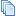
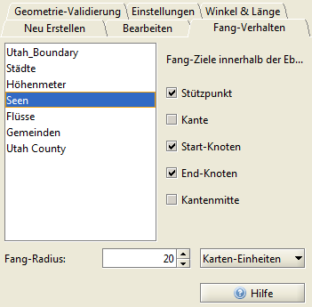

==========================
Arbeiten mit GeoObjekten
==========================

-----------------------
GeoObjekte selektieren 
-----------------------
Damit ein GeoObjekt selektiert werden kann, muss zuvor die betreffende Ebene in der Ebenenan­sicht sichtbar geschaltet (Häkchen) und markiert sein. Danach rufen Sie die Funkti­on entweder in die Menüleiste über *Bearbeiten >* |selectObject| *Objekte selektieren*  oder inner­halb der Werkzeugleiste als |selectObject| Button auf. Punkt- und Linien-Objekte sind nur durch das Aufziehen ei­nes Auswahl-Rechtecks zu selektieren, Flächen-Objekte darüber hin­aus auch durch Klicken mit der linken Maustaste in die betreffende Fläche. 

Eine Mehrfachauswahl ist in allen Fällen möglich, solange während des Auswahlvorgangs die ``[Strg]`` Taste gedrückt gehal­ten wird. Die jeweilige Auswahl wird teilweise oder komplett wieder auf­gehoben, indem bei gedrückter ``[Strg]`` Taste nochmals auf die selektierten Objekte geklickt, bzw. bei Punkt- oder Li­nien-Objekten nochmalig das Auswahlrechteck über den zu entfer­nenden Markie­rungen aufgezo­gen wird. 

Die gesamte Auswahl kann auch aufgehoben werden, indem Sie auf eine Stelle in der Kartenansicht klicken, welche keine Objekte enthält.

Selektierte Objekte können: 

- in eine neue Ebene kopiert werden
- als Referenz-Geometrie dienen (3.2.1 wfs, 3.5 Geoprocessing, 3.6 Geoimaging, Recherche 4) 
- es kann die Kartenansicht auf sie zentriert und vergrößert werden 
- es ist möglich, Geometrie- und Attribut-Informationen aufzurufen 	

----------------------
Informationen aufrufen
----------------------

Objekt Statistik
^^^^^^^^^^^^^^^^
Nachdem **einzelne Objekte** mit Hilfe der Funktion  |selectObject| *Objekt selektieren*  ausgewählt wurden, können die zugehörigen Geometriedaten über die Menüleiste *Werkzeuge >* |featureStatistic| *Objekt-Geome­trie anzeigen*  in einem separaten Fenster aufgerufen werden. Werden mehrere Objekte ausge­wählt, sind die Angaben für jedes Objekt in einem separatem Register angezeigt. 

Der Register *Zusammenfassung* listet zusätzlich die Gesamt-Fläche und verschiedene Längenanga­ben aller selektierten Objekte in Metern auf.

Auf diese Weise rufen Sie auch statistische Angaben für **ag­gregierte Objekte** (Multi-Linien und Multi-Oberflächen-Objek­te) auf. Hierfür zuerst die Ebenen in der Ebe­nenansicht se­lektieren, in der sich das Objekt befin­det, danach mit Hilfe der Funktion |selectObject| *Objekt selektieren*  das ge­wünschte Objekt innerhalb der Kartenansicht markie­ren und auf |featureStatistic| *Objekt-Geome­trie anzeigen*  klicken. 
 
.. |selectObject| image:: images/selectObject.png

Attributtabelle öffnen
^^^^^^^^^^^^^^^^^^^^^^
Die Attribut-Daten einer Ebene lassen sich nach dem Selektieren der Ebene als Attribut Tabelle öffnen, hierzu in der Menüleiste zu *Ansicht >*  |table| *At­tribut-Tabelle öffnen*  navigieren oder in der Werkzeugleiste auf den |table| Button klicken. Wurden zuvor Objekt ein der Kartenansicht selektiert, werden diese farbig hervorgehoben.

Die Daten können innerhalb der Tabelle spaltenweise sortiert werden: Aufstei­gend durch Klick mit der linken Maustaste, absteigend durch Klick mit der rechten Maustaste je­weils auf den Spaltennamen.	

.. |table| image:: images/table.png

Objektinformation aufrufen
^^^^^^^^^^^^^^^^^^^^^^^^^^

Nach dem Selektieren der gewünschten Ebene die Funktion |objectInfo| *Ob­jektinformation an­zeigen* in der Werkzeugleiste oder in der Menüleiste über *Bearbeiten > Objektinformati­on anzeigen* akti­vieren und anschließend die gewünschten Objekte in der Kartenan­sicht durch anklicken mit der LM selektieren. In der sich öffnenden Attribut-Tabelle werden daraufhin nur die selektierten Ob­jekte angezeigt. 

Die Daten können innerhalb der Tabelle spaltenweise sortiert werden: Aufstei­gend durch Klick mit der linken Maustaste, absteigend durch Klick mit der rechten Maustaste je­weils auf den Spaltennamen.	

-----------------------------------
GeoObjekte importieren/exportieren
-----------------------------------

GPS-Daten importieren
^^^^^^^^^^^^^^^^^^^^^^^
GPS-Daten können Sie als *neue Ebene aus Datei* laden, sofern sie im  */*.gpx* Dateiformat vorliegen. Die Anwendung er­zeugt daraus eine neue Ebene mit den entsprechenden Koordinaten als Punktobjekte.

Folgende Möglichkeiten stehen zur Verfügung:

- über *Projekt >  Neue Ebene hinzufügen > Vektordaten > Datei*
- über den entsprechenden  Button in der Werkzeugleiste 
- über Projekt >  Ebene aus Datei hinzufügen

GeoObjekte kopieren
^^^^^^^^^^^^^^^^^^^^^^
Nachdem einzelne oder mehrere Objekte entweder in der Kartenansicht oder in der Attribut Tabel­le selektiert wurden, können sie kopiert werden:

- als WKT Notierung: innerhalb der Werkzeugleiste über den |copy_feature_as_wkt| *Objekt(e) als WKT ko­pieren* Button. Die so kopierten Daten können in andere Bearbeitungs-Pro­gramme eingefügt werden. 
- als FeatureCollection (*\*.gml*): innerhalb der Werkzeugleiste über den |copy_feature| *Objekt(e) ko­pieren* Button . 

Die so kopierten Objekte können

- in eine an­dere Ebe­ne über den |paste_feature| *Objekt(e) einfügen* But­ton eingefügt wer­den 
- in ein anderes Bearbeitungs-Programm überführt werden

.. |copy_feature| image:: images/copy_feature.png
.. |paste_feature| image:: images/paste_feature.png

GeoObjekte in eine neue Ebene kopieren
^^^^^^^^^^^^^^^^^^^^^^^^^^^^^^^^^^^^^^
Einzelne oder mehrere Objekte können, nachdem sie in der Kartenansicht selektiert wur­den, in ei­ner neuen Ebene gespeichert werden. Die entsprechende Funktion rufen Sie in der Werkzeugleiste über den |feature_to_layer| *ausgewählte Objekte in einer neuen Ebene speichern* Button auf. Nachdem für die neue Ebene ein Name eingegeben und mit  ``[OK]``  bestätigt wurde, erscheint diese in der Ebenen- und Kartenansicht.

.. |export_layer| image:: images/export_layer.png

Hinweis:
	Die so erzeugte Ebene existiert erst einmal nur als temporäre Ebene im Projekt und geht beim Schließen der Anwendung verloren. Soll diese Ebene auch darüberhinaus genutzt werden können, muß sie exportiert werden. Hierzu das Kontextmenü der Ebene aufrufen (Rechtsklick auf den Ebenennamen) und |export_layer| *Ebene exportieren* wählen.

Sachdaten kopieren
^^^^^^^^^^^^^^^^^^
Objekte, wel­che innerhalb der Attribut-Tabelle durch Anklicken ausgewählt werden, erscheinen farblich her­vorgehoben in der Kartenansicht. 
Es können einzelne, mehrere (bei gedrückter ``[Shift]`` -Taste) oder alle (``[Strg+A]``) Objekte ausgewählt werden. Wurde ein/mehrere Objekte auf diese Art mar­kiert, stehen innerhalb der Attribut Tabelle folgende Optionen zur Verfügung:

- Kartenausschnitt auf die gewählten Objekte vergrößern |lupe|
- ausgewählte Objekte kopieren |copy|
- alle Objekte kopieren |copy_all|

Die so kopierten Daten können als Text in andere Textverarbeitungs-Programme eingefügt wer­den. 

.. |lupe| image:: images/lupe.png
.. |copy| image:: images/copy.png

------------------------------------------
GeoObjekte neu erstellen (Digitalisieren)
------------------------------------------
Bevor ein neues Objekt gezeichnet oder existierende Objekte verändert werden kann, muss die entsprechende Ebene in der Ebe­nenansicht selektiert und |editable| editierbar geschaltet sein (über das Kontextmenü in der Ebenen-Ansicht). Für alle neuen Objekte gilt, dass die betreffende Ebene den jeweiligen Geo­metrie-Typ entweder enthalten oder unterstützen muss. Andernfalls ist es möglich, die neu ge­zeichneten Objekte zu speichern. 

Die Digitalisier-Funktion rufen Sie in der Werkzeugleiste über den entsprechenden |digitizer| Button oder in der Menüleiste über *Werkzeuge >* |digitizer| *Objekt-Geometrie bearbeiten* auf. Mit Hilfe der Funktio­nen innerhalb des Registers  *Neue Objekte erstellen* können neue Punkt-, Linien- und Flä­chen-Objekte erstellt, bzw. vorhandene Objekte bearbeitet werden. 

.. |editable| image:: images/editable.png

Sie folgende Möglichkeiten:

Bestehende Objekte können in den Zeichenprozess miteinbezogenen wer­den. Hierfür zuerst das betreffende Objekt nach dem Aktivie­ren des |cursor_small| Buttons selektieren. Anschließend in den Regis­ter *Fang-Verhalten* wechseln. Hier die geeigneten Einstellun­gen vornehmen. Das Fang-Verhalten stellt eine automati­sche Bearbeitungsoperation dar, in der Punkte, welche in die Nähe anderer Punkte oder Li­nien fallen, leicht verschoben wer­den, so dass sie korrespondieren. Da­durch wird das Erstellen topo­logisch korrekter Geometrie­n er­leichtert. 	

Das Registers Fang-Verhalten zeigt auf der lin­ken Sei­te alle im aktuellen Projekt vorhan­denen Ebenen. Die­se können durch Ankli­cken ausge­wählt werden. Die für diese Ebene gesetzten Ein­stellungen hinsichtlich des Fangverhaltens bildet die rechte Seite ab.  Dort können die Einstellungen zudem bear­beitet werden.
Ne­ben den Fang-Zielen und dem Fang-Radius entscheiden Sie über die zugrunde liegende Einheit: Pixel oder Karten-Einheiten. Während des Editiervorgangs ist dann der eingestellte Radi­us als grü­ner Kreis angezeigt.

Folgende topologische Begriffe werden verwendet:

Nach dem Erstellen der neuen Objekte kann und sollte die Gültigkeit der Geometrie- und Topolo­gie-Eigenschaften überprüft werden. Dies kann sowohl für ein einzelnes Objekt, als auch für die gesamte Ebene durchgeführt werden. Die dafür nötigen Einstellungen nehmen Sie im Re­gister *Geometrie-Überprüfung* vor.

Innerhalb des Registers Geometrie Metrik:

	- sich wiederholende Punkte zulassen
	- die Orientierung der Polygone prüfen
	- doppelte Geometrie zulassen
	- einfache Linien erlauben
	- Mindestlänge der Teilstücke/Polygone 

Innerhalb des Registers Geometrie Arten:

	- Punkte/Linien/Polygone zulassen
	- MultiPoints/-Linies/-Oberflächen zulassen
	- Geometrie-Kollektionen zulassen
	- Löcher in Polygonen zulassen
	- Löcher in MultiOberflächen zulassen
	- Nicht-lineare Interpolation erlauben

Innerhalb des Registers Topologie:

	- sich überschneidende Geometrien erlauben 
	- sich berührende Geometrien erlauben
	- gleiche Geometrien erlauben	

Die neu erstellten Objekte können nun gespeichert oder/und in einem nächsten Schritt weiter be­arbeitet werden (siehe Geometriedaten bearbeiten).
	
.. |cursor_small| image:: images/cursor_small.png

------------------------------------------
GeoObjekte bearbeiten
------------------------------------------
Bevor existierende Objekte bearbeitet werden können, muss die entsprechende Ebene in der Ebe­nenansicht selektiert und |editable| editierbar geschaltet sein (über das Kontextmenü in der Ebenen-Ansicht).

Sachdaten bearbeiten
^^^^^^^^^^^^^^^^^^^^
Die Bearbeitungsfunktionen rufen Sie in der Menüleiste über *Werkzeuge >* |digitizer| *Objekt-Geometrie be­arbeiten* oder über den entsprechenden  |digitizer| Button in der Werkzeugleiste auf. Indem sich an­schließend neu öffnenden Dialogfenster, wird nun das Register **Bearbeiten** gewählt. Inner­halb die­ses Registers haben Sie die Möglichkeit, nach der Aktivierung des Buttons |cursor_small| Objekt se­lektieren eines oder mehrere Objekte zu selektieren. Die Anzeige der Attributdaten der ge­wählten Objekte erfolgt in einem separatem Fenster, wo diese auch bearbeitet werden können. Nachdem die Änderungen vorgenommen wurden, müssen diese durch das Betätigen der Return-Taste und ``[Übernehmen]`` bzw. ``[Übernehmen und schließen]`` bestätigt werden. 

Wichtig: 
	Die so editierten Daten werden nicht automatisch in die Datenquelle zurückgeschrieben, sondern sind in dieser Form projektbezogen gespeichert. Sollen die Daten auch außerhalb des Pro­jektes zur Verfügung stehen, müssen sie durch |commit_selected| *ausgewählte Ebene speichern* / |commit_all|  *alle Ebenen speichern*  in die jeweilige Datenquelle zurückgeschrieben werden. Dies geschieht nicht automatisch beim Speichern und Schließen eines Projektes.
	
.. |commit_all| image:: images/commit_all.png
.. |commit_selected| image:: images/commit_selected.png

Geometrien bearbeiten
^^^^^^^^^^^^^^^^^^^^^
Die entsprechenden Bearbeitungsfunktionen rufen Sie in der Menüleiste über *Werkzeuge >* |digitizer| *Ob­jekt-Geometrie bearbeiten* oder über den entsprechenden |digitizer| Button in der Werkzeugleiste auf. Mit Hilfe der Funktionen innerhalb des Registers *Objekte bearbeiten* können Sie vorhandene Punkt-, Linien- und Flächen-Objekte bearbeiten, nachdem diese zuvor mit Hilfe der Funktion |cursor_small| *Objekte se­lektieren* markiert sind. 	

Folgende Bearbeitungs-Optionen stehen zur Verfügung:

