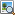

==========================
Geoimaging
==========================

----------------------------------
Geodaten aus Exif-Format auslesen 
----------------------------------
Die Funktion befindet sich in der Menüleiste unter *Werkzeuge >* |picture_add| *georeferenzierte Bilder hinzufügen*. Nach dem Aktivieren der Funktion öffnet sich ein neues Fenster, in welchem zum Speicherort der Bilddatei navigiert wird. Es können sowohl einzelne Bilder als auch Bildergruppen (Verzeichnisweise oder durch Mehrfachauswahl bei gedrückt gehaltener ``Strg`` Taste) ausgewählt und geladen werden. Diese Bilddateien müssen im *\*.jpg*  oder *\*.tiff* Dateiformat vorliegen und in ihrem Exif-Header gültige Koordinatenangaben enthalten. Alle gewählten Bilddateien werden nach der Vergabe eines neuen Ebenen-Namens in einer neuen Ebene als Punkte darge­stellt.

Um so importierte Bilder zu betrachten,  muss das entsprechende Punktobjekt in der Kartenansicht selektiert werden. Aktivieren sie nun die Funktion  |picture_show| in der Menüleiste unter *Werkzeuge*. Das Bild wird nun in einem Bildbetrachtungsprogramm (Standartbildbetrachter des jeweiligen Rechners.) geöffnet. 

-------------------------------------
Bilddateien mit Koordinaten versehen
-------------------------------------
Mit Hilfe dieser Funktion verknüpfen Sie Koordinatenangaben mit Bilddateien. Hierfür muss zuerst innerhalb der Kartenansicht entweder ein existierender Punkt mit |selectObject| markiert oder ein neuer Punkt digitalisiert und anschließend mit |selectObject| markiert sein. Erst dann kann die Funktion über die Menüleiste unter *Werkzeuge >* |picture_link| *Exif-Header hinzufügen* aufgerufen werden. Nach dem Aktivieren der Funktion öffnet sich ein neues Fenster, in welchem zu der Bilddatei navigiert wird, welche die Koordi­naten des selektierten Punktes erhalten soll. Nachdem das Bild ausgewählt und mit ``[OK]`` bestätigt wurde, sind die Koordinatenangaben im Exif-Header des Bildes gespeichert.

.. |picture_link| image:: images/picture_link.png
.. |selectObject| image:: images/selectObject.png

---------------------------------
Bilddateien georeferenzieren
---------------------------------

