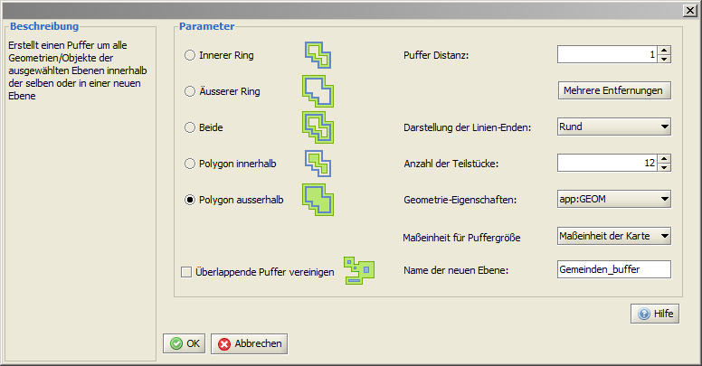
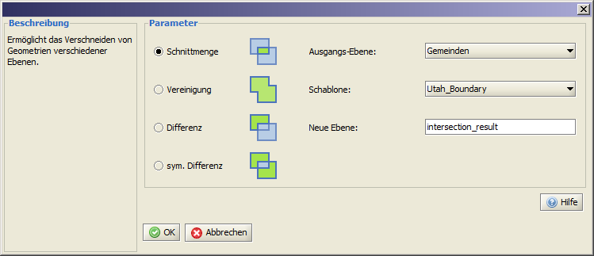
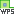
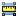

==========================
Geoprocessing
==========================
deegreeDesktop bietet Ihnen verschiedene Funktionalitäten für die erweiterte Verarbeitung und Analyse von Geodaten. Dazu gehört derzeit das Erzeugen von Puffern, die Verschneidungsfunktio­n, der Web Processing Service Buffer und das Erzeugen von einem Punkt innerhalb eines Polygons.

-----------------------
Puffer erzeugen
-----------------------
Sie haben die Möglichkeit, verschiedene Puffer (Buffer) um Punkt-, Linien- und Flächengeo­metrien zu er­stellen. Dies kann sowohl für alle Objekte einer Ebene geschehen, als auch für ausge­wählte Objek­te einer Ebene. In beiden Fällen muss vorher die zu bearbeitende Ebene in der Ebenenans­icht se­lektiert werden. 

	- Sollen um alle sich in dieser Ebenen befindlichen Objekte Buffer er­stellt werden, aktiviert man anschließend die Bufferfunktion. 
	- Möchte Sie nur um bestimmte Objekte einen Buffer erstellen, müssen diese nach der Aktivierung der Funktion |selectObject| *Ob­jekte selektieren* noch markiert werden.

Die Bufferfunktion rufen Sie innerhalb der Menüleiste über *Werkzeuge >* |buffer| *Puffer* auf. Über das Dialogfenster können Sie verschiedene Einstellun­gen hinsichtlich der Puffer-Eigenschaf­ten vornehmen. 
Das Ergebnis der Puffererzeugung wird in ei­ner neuen Ebene gespeichert und der Ebenenansicht hinzugefügt. 

.. |selectObject| image:: images/selectObject.png

	
Wichtig
	Beachten Sie bitte, dass je nach Datenmenge der Berechnungsprozess einige Zeit in An­spruch nehmen kann.
	
	Die so erstellten Ebenen existieren nur im Verlauf der jeweiligen Arbeitssession, da sie in­nerhalb des temporären Speichers abgelegt werden. Sollen diese Ebenen permanent zur Verfü­gung stehen, müssen diese als |export_layer| Ebene exportiert werden. Laden Sie die so exportierte Ebe­ne erneut in ihr Projekt und definieren Sie erst dann die Darstellungsregeln.
	
	
-----------------------
Verschneidung erzeugen
-----------------------

Diese Funktion bietet die Möglichkeit, sowohl einzelne Objekte mit einer Ebene als auch komplette Ebenen miteinander zu verschneiden. Sollen einzelne Objekte einer Ebene als Schablone dienen, müssen diese vor dem Starten der Funktion selektiert sein (zuerst die betreffende Ebene, dann das Objekt). Um komplette Ebenen miteinander zu verschneiden, ist dies nicht notwendig. 
Die Funktion rufen Sie innerhalb der Menü-Leiste über *Werkzeuge >* |intersection| *Verschneidung* auf. Die Ausgangsebene enthält die Objekte, welche zugeschnitten werden sollen. Die zweite Ebene dient als Schablone.
Das Ergebnis der Verschneidung wird in ei­ner neuen Ebene gespeichert und der Ebenenansicht hinzugefügt. 

	
Wichtig
	Je nach Datenmenge kann der Berechnungsprozess bis zu einigen Minuten dauern. 
	
	Die so erstellten Ebenen existieren nur im Verlauf der jeweiligen Arbeitssession, da sie in­nerhalb des temporären Speichers abgelegt werden. Sollen diese Ebenen permanent zur Verfü­gung stehen, müssen diese als |export_layer| Ebene exportiert werden. Laden Sie die so exportierte Ebe­ne erneut in ihr Projekt und definieren Sie erst dann die Darstellungsregeln.
	
-----------------------
WPS Puffer
-----------------------
Diese Funktionalität beinhaltet das Aufrufen eines vordefinierten Geoprozesses, in diesem Fall ist als Beispiel das Erzeugen eines räumlichen Puffers eingebunden. Mit dieser Funktion kön­nen so­wohl einzelne oder mehrere vorher markierte Objekte einer Ebene, sowie komplette Ebenen bear­beitet werden. 
Vor dem Aufrufen der Funktion muss zuerst die betreffende Ebene in der Ebenenansicht markiert und ggf. die betreffenden Objekte selektiert werden. Anschließend wird die Funktion *Menüleiste > Werkzeuge >* |wps| *WPS-Buffer* aktiviert. In dem sich öffnenden Dialogfenster können wie bei der Puffererzeugung die entsprechenden Einstellungen vorgenommen werden. Zusätzlich ist es möglich die URL des ge­wünschten WPS, sowie den Prozess (derzeit nur puffer) zu wählen.  Nach dem Bestätigen mit ``[OK]`` wird der Puffer berechnet und in einer neuen Ebene angezeigt.

Prinzipiell können hier auch andere Arbeitsprozesse definiert werden.	

----------------------------------------
Punkt innerhalb eines Polygons erzeugen
----------------------------------------

Mit Hilfe dieser Funktion kann innerhalb von Polygon enthaltenden Ebenen jeweils ein garantiert innenliegend Polygone lokalisierter Punkt generiert werden. Hierzu muss zuerst die entsprechende Ebene in der Ebenenansicht selektiert sein, danach die Funktion in der Menüleiste unter *Werkzeuge >* |point| *repräsentativen Punkt erzeugen*  aktivieren oder auf den |point| Button in der Werkzeugleiste kli­cken. Unterhalb der Ausgangsebene wird daraufhin eine neue Ebene erstellt, welche die jeweiligen Punktobjekte enthält. 

Wichtig 
	Die so erstellten Ebenen existieren nur im Verlauf der jeweiligen Arbeitssession, da sie in­nerhalb des temporären Speichers abgelegt werden. Sollen diese Ebenen permanent zur Verfü­gung stehen, müssen diese als |export_layer| Ebene exportiert werden. Laden Sie die so exportierte Ebe­ne erneut in ihr Projekt und definieren Sie erst dann die Darstellungsregeln.

.. |export_layer| image:: images/export_layer.png

----------------------------------------
Entfernung messen
----------------------------------------

|ruler|

----------------------------------------
Fläche messen
----------------------------------------

|ruler2|

----------------------------------------
Länge/Fläche berechen
----------------------------------------

|table_column_add|

