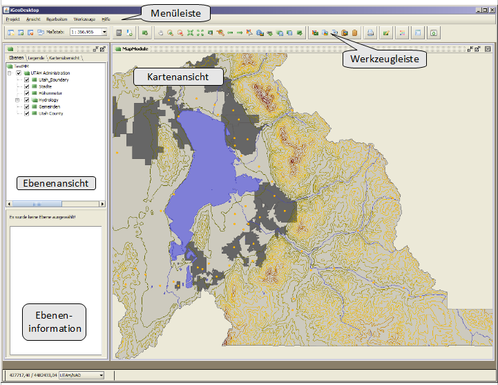
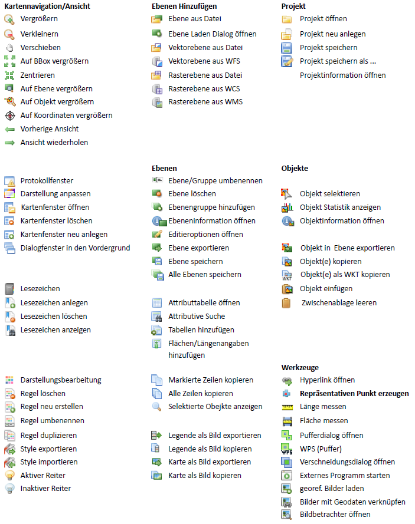


==================
Benutzeroberfläche
==================
Im oberen Fensterbereich befindet sich die Menü-Leiste, über welche die meisten Funktionen auf­gerufen wer­den können. Eine Auswahl dieser Funktionen befindet sich außerdem in der darun­ter liegenden Werkzeugleiste sowie im Kontextmenü der Kartenansicht.	

Innerhalb des Kontextmenüs der Ebenenansicht und der Legende befinden sich weitere, ebenen­spezifische Funktio­nen, deren Aufruf nicht über die Menü- bzw. Werkzeugleiste vorgesehen ist.

Unterhalb der Ebenenansicht kann, sofern vorhanden, innerhalb des Ebenen-Informationsfeldes eine Kurzbeschreibung der jeweils selektierten Ebene eingesehen werden.

Funktions Übersicht
^^^^^^^^^^^^^^^^^^^^

	
Shortcut Übersicht
^^^^^^^^^^^^^^^^^^^^

| ``[Strg+N]``	neues Projekt anlegen
| ``[Strg+P]``	neues Projekt aus Datei anlegen
| ``[Strg+O]``	Projekt öffnen 
| ``[Alt+F]``		Ebene aus Datei laden

| ``[Strg+S]``	Projekt öffnen 

| ``[Strg+B]``	alle Dialogfenster in den Vordergrund 
| ``[Strg+Q]``	alle Dialogfenster in Schließen

| ``[Strg+K]``	Layout ändern

| ``[F1]``	Hilfe öffnen

| ``[Alt+Umschalt+A]``	Versionsinformation öffnen
