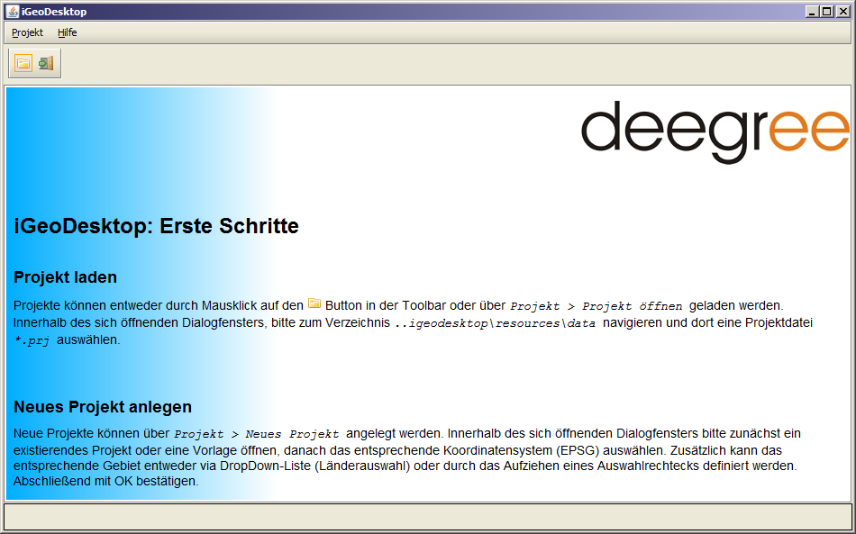

.. _anchor-installation:

============
Installation
============

deegreeDesktop kann als DesktopGIS installiert oder als WebStart Applikation betrieben werden. Nachfolgend wird die Installation als DesktopGIS beschrieben.

**Systemvorraussetzungen**

	* Windows XP, Vista, 8
	* Linux
	* Mac OS X

**Download**

deegreeDesktop kann von der `deegree home page <http://www.deegree.org>`_ heruntergeladen werden. Es stehen folgende Pakete zur Verfügung:

	* *EXE*:
	* *WAR* 

.. tip:

**Anwendung installieren**

	* **Windows** Führen Sie die ``deegreeDesktop.exe`` aus und folgen Sie den Anweisungen des Installations-Assistenten.

	* **Linux/Solaris** Führen Sie die ``linux-x86-Install`` Datei aus. Unter Linux ist zu beachten, dass zur korrekten Darstellung der Programmbestand­teile alle visuellen Effekte des Betriebssystems deaktiviert sein müssen.

	* **Mac OS X**

**Anwendung starten**

	* **Windows** Starten Sie die Anwendung entweder über das bei der In­stallation angelegte Desktop-Icon oder über die ``run.bat`` Datei, welche im Unter­ordner deegreeDesktop des Installationsverzeichnisses deegreeDesktop liegt. 

	* **Linux** Führen Sie die ``run.sh`` Datei aus (welche im Unterordner deegree­Desktop des Installations­verzeichnisses deegreeDesktop liegt) oder starten Sie die Anwendung über die Konsole, indem zum In­stallationsverzeichnis navigiert wird.

	* **Mac OS X**

Nach dem Starten, sollte der folgende Startbildschirm erscheinen:

Folgen Sie den Anweisungen unter **Projekt laden** und navigieren sie innerhalb Ihres Installations­verzeichnisses zu *deegreeDesktop/resources/data*.

Laden Sie das Beispielprojekt: *innerframe_layout_utah_county.prj*. Diese Konfiguration enthält alle derzeit in deegreeDesktop vorhan­denen Funktionalitäten, sowie Beispielebenen für Punkt-, Linien- und Polygon-Geometrien.

