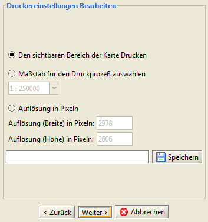
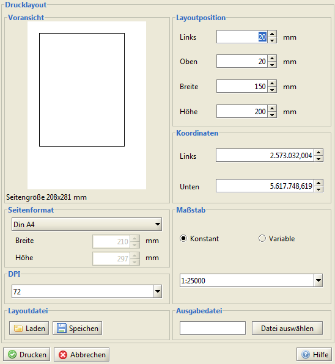

==========================
Drucken
==========================

----------------------------------
PDF erzeugen
----------------------------------
Mit Hilfe der Funktion |s_pdf| *PDF erzeugen* erstellen Sie anhand der aktuellen Karten- und Legendenansicht ein PDF. Derzeit stehen zwei Druckvorlagen zur Verfügung (Hoch- und Querformat), welche als Vorschau innerhalb des sich öffnen­den Druckdialogfensters ausgewählt werden können. Beim Druckbereich stehen fol­gende Optionen zur Verfügung:

Geben Sie Speicherort und der Dateiname an und klicken Sie auf ``[Weiter]``. Die folgenden Angaben sind optional:

	- Titel
	- Autor
	- Datum
	- Beschreibung
	- Datenquelle 

Gedruckt wird die Kartenansicht mit Legende.

----------------------------------
vektorielles PDF erzeugen
----------------------------------
Mit Hilfe der Funktion |pdf| *vektorielles PDF erzeugen* können vektorielle PDF Dateien von DIN A5 bis DIN A0 erzeugt werden. Einmal angelegte Layout-Designs lassen sich speichern und wieder laden.

----------------------------------
Direktdruck
----------------------------------
Mit der Funktion |printer| *Drucken* wird die direkte Ausgabe an einen Drucker veranlasst. Je nachdem welche Drucker in Ihrem Netzwerk zur Verfügung stehen, öffnen sich die zugehörigen Dialoge in einem neuen Fenster.	

Gedruck wird die Kartenansicht ohne Legende.

.. |printer| image:: images/printer.png

