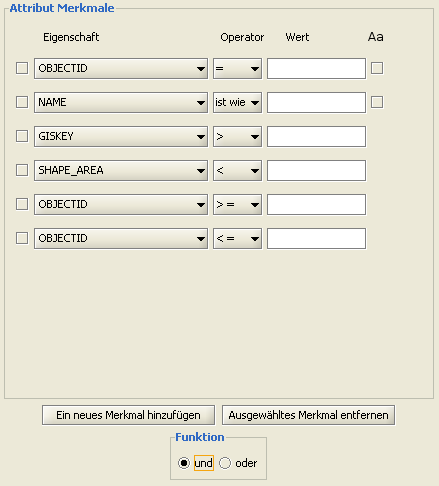

==========================
Recherche
==========================

----------------------------------
Hotlink
----------------------------------
Diese Funktionalität ermöglicht es Ihnen, Hyperlinks in einem separatem Browserfenster zu öffnen. Der Hyperlink muss hierzu vollständig in Form einer http-url vorliegen, welche mit einem Objekt verknüpft ist. Den Hotlink können Sie auf zwei Arten öffnen: entweder aktivieren Sie zuerst den entsprechenden |hyperlink| Button in der Werkzeugleiste und klicken anschließend auf das, mit einem Hot­link verknüpfte Objekt, oder Sie markieren zuerst das Objekt und wählen dann aus dem Kontextmenü |hyperlink| +Hyperlink öffnen+. 

In beiden Fällen öffnet sich der entsprechende Link in einem separaten Browserfenster.

.. |hyperlink| image:: images/hyperlink.png

----------------------------------
externe Programme starten
----------------------------------
Mit Hilfe des |external_program| Buttons rufen Sie ein bestimmtes externes Programm etwa ein Textverarbeitungs­programm auf. Als Voreinstellung ist hier das Programm Notepad konfiguriert. 

Es können beliebig viele verschiedene Programme definiert werden.

.. |external_program| image:: images/external_program.png

----------------------------------
attributive Abfragen
----------------------------------
Diese Funktion durchsucht eine bestimmte Ebe­ne anhand definierter Kriterien. Die betref­fende Ebene muss zuerst in der Ebenen­ansicht selektiert werden, anschlie­ßend innerhalb der Menü­leiste über  *Werkzeu­ge >* |attribut_search| *attributiv­e Suche* navigie­ren.	
	 
Innerhalb des sich öffnenden Dialoges können Sie nun individuelle Filter definieren. Um Merk­male wieder zu entfernen, setzten Sie vor der betref­fenden Zeile im Kästchen ein Häkchen  und kli­cken Sie auf ``[Ausgewähltes Merkmal entfer­nen]``.	
 
Sind alle Filter definiert können die betreffen­den Objekte innerhalb der Karte durch das Kli­cken auf ``[Anzeigen]`` visualisiert werden. 

	
----------------------------------
GetOwner
----------------------------------

----------------------------------
Gazetteer
----------------------------------

